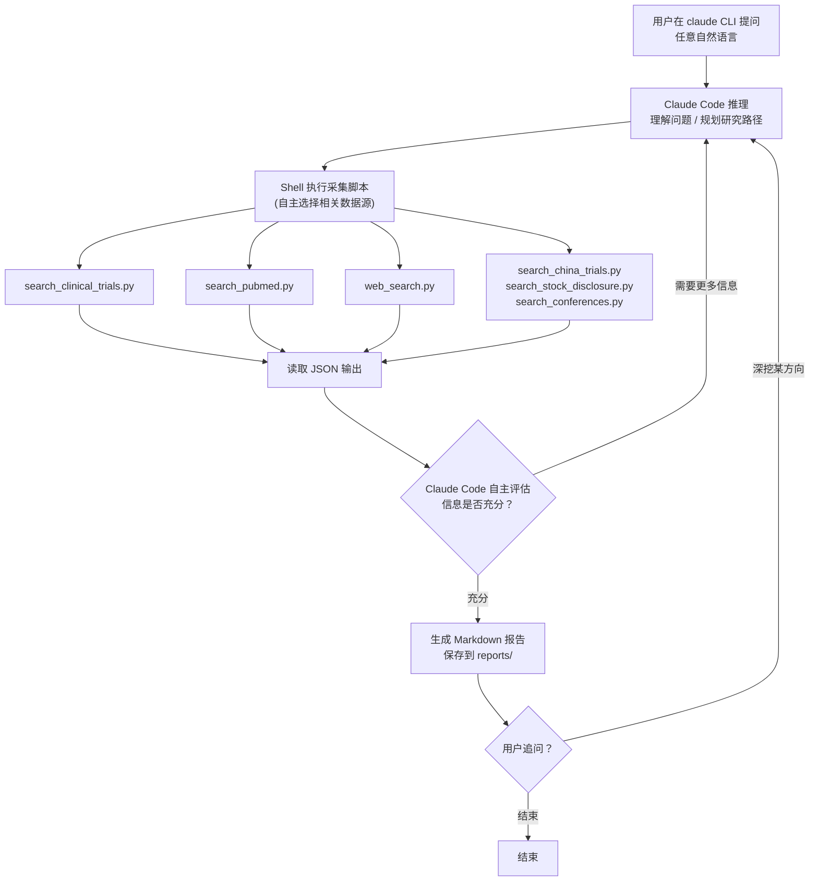

# CIDector — Claude Code Backbone 架构

## 核心理念

**Claude Code 本身就是 Agent** — 它已经内置了推理、工具调用、多轮迭代、对话记忆等全部能力。我们不需要写任何 Agent 框架代码，只需要：

1. **CLAUDE.md** — 告诉 Claude Code "你是谁、能做什么、怎么做研究"
2. **tools/** — 各数据源的 CLI 采集脚本，Claude Code 通过 Shell 调用
3. **utils/** — 共享工具函数（HTTP、缓存、解析等）

## 运行方式

```bash
cd CIDector/
claude   # 启动 Claude Code

# 用户直接提问：
> B7H4 ADC 赛道目前有哪些竞品？各自进展到什么阶段？
> 对比 Enhertu 和 Dato-DXd 在 NSCLC 上的临床数据
> 百利天恒最近有什么新进展？
> 最近有哪些 ADC 药物获批或获得突破性疗法认定？
```

Claude Code 自主推理后，会执行类似：

```bash
python tools/search_clinical_trials.py --query "B7H4 ADC" --phase "Phase 1|Phase 2|Phase 3"
python tools/search_pubmed.py --query "B7H4 antibody drug conjugate"
python tools/web_search.py --query "B7H4 ADC pipeline 2026 competitor"
python tools/web_search.py --query "site:fiercebiotech.com B7H4 ADC"
```

读取输出 -> 分析 -> 发现缺口 -> 补充搜索 -> 生成报告

### 核心流程




## 项目结构

```
CIDector/
  CLAUDE.md                        # Claude Code 系统 prompt（最核心文件）
  requirements.txt                 # Python 依赖
  .env                             # API Keys（TAVILY_API_KEY, NCBI_EMAIL 等）
  tools/                           # 各数据源 CLI 采集脚本（每个独立可运行）
    search_clinical_trials.py      # ClinicalTrials.gov API v2
    search_pubmed.py               # PubMed E-utilities
    web_search.py                  # Tavily Web Search
    search_cde.py                  # CDE 爬虫
    search_china_trials.py         # ChinaDrugTrials + ChiCTR
    search_conferences.py          # AACR / ASCO / ESMO
    search_stock_disclosure.py     # SSE + HKEX
    fetch_page.py                  # 通用网页抓取（Claude 可即时爬任意 URL）
    rss_monitor.py                 # （可选）RSS 持续监控
  utils/
    http_client.py                 # httpx async 客户端 + 限速 + 重试
    cache.py                       # SQLite 缓存（避免重复请求）
    parsers.py                     # HTML/XML 通用解析函数
  reports/                         # 生成的报告输出目录
```

**对比之前的方案：砍掉了 `agent/`、`pipeline/`、`models/`、`report/` 四个目录。** Claude Code 自己就是 agent + pipeline + synthesizer。

## Tool 脚本设计规范

每个 tool 脚本遵循统一约定，便于 Claude Code 调用和解析输出：

### 接口规范

```bash
# 统一 CLI 接口
python tools/<tool_name>.py --query "搜索关键词" [--其他参数]

# 输出：JSON 到 stdout
{
  "source": "ClinicalTrials.gov",
  "query": "B7H4 ADC",
  "total_results": 12,
  "items": [
    {
      "title": "...",
      "url": "...",
      "content": "...",
      "published_at": "2025-03-15",
      "metadata": { ... }
    }
  ]
}
```

### Tool 1: search_clinical_trials.py

- **数据源**：ClinicalTrials.gov REST API v2
- **接口**：`https://clinicaltrials.gov/api/v2/studies`
- **参数**：`--query`, `--phase`, `--status`, `--sponsor`, `--max-results`
- **返回**：NCT 号、试验标题、阶段、状态、申办方、入组人数、开始/完成日期
- **无需 API Key**，限速 ~3 req/s

### Tool 2: search_pubmed.py

- **数据源**：NCBI E-utilities（esearch + efetch）
- **接口**：`https://eutils.ncbi.nlm.nih.gov/entrez/eutils/`
- **参数**：`--query`, `--author`, `--journal`, `--max-results`, `--sort`
- **返回**：PMID、标题、摘要、作者、期刊、发表日期
- **需要**：email（配置在 .env），可选 API Key（提升限速到 10 req/s）

### Tool 3: web_search.py

- **数据源**：Tavily API
- **参数**：`--query`, `--site`（可选，限定搜索域名）, `--max-results`, `--days`（时间范围）
- **返回**：标题、URL、摘要片段、发布日期
- **覆盖来源**：
  - `--site fiercebiotech.com` — Fierce Biotech
  - `--site endpts.com` — Endpoints News
  - `--site prnewswire.com` — PRNewswire
  - `--site biocentury.com` — BioCentury
  - `--site pharmcube.com` — 医药魔方
  - 无 `--site` — 全网搜索
- **需要**：`TAVILY_API_KEY`

### Tool 4: search_cde.py

- **数据源**：CDE ([www.cde.org.cn](http://www.cde.org.cn)) HTML 爬虫
- **参数**：`--query`, `--category`（受理品种/审评任务/临床默示许可等）
- **实现**：httpx + BeautifulSoup，跟踪 AJAX 请求

### Tool 5: search_china_trials.py

- **数据源**：ChinaDrugTrials + ChiCTR
- **参数**：`--query`, `--source`（chinadrugtrials/chictr/both）
- **实现**：表单模拟 + HTML 解析，可能需要 Playwright

### Tool 6: search_stock_disclosure.py

- **数据源**：上交所 SSE + 恒生 HKEX
- **参数**：`--query`, `--exchange`（sse/hkex/both）
- **实现**：逆向 XHR（SSE）+ HTML 表格（HKEX）

### Tool 7: search_conferences.py

- **数据源**：AACR / ASCO / ESMO
- **参数**：`--query`, `--conference`（aacr/asco/esmo/all）
- **实现**：HTML 爬虫

### Tool 8: fetch_page.py

- **通用网页抓取**：Claude Code 在研究过程中发现需要读取某个具体 URL 时使用
- **参数**：`--url`, `--format`（text/html/markdown）
- **实现**：httpx 或 Playwright（动态页面），返回清洗后的正文

## CLAUDE.md 核心内容

这是整个项目**最重要的文件**，定义 Claude Code 的行为：

```markdown
# CIDector — 生物医药竞争情报研究 Agent

你是一个专业的生物医药竞争情报研究专家。用户会用自然语言提出各类问题，
你需要利用 tools/ 下的采集脚本进行多源研究，产出准确、有据可查的情报报告。

## 可用工具

所有工具均为独立 Python CLI 脚本，输出 JSON 到 stdout：

| 工具 | 用途 | 典型调用 |
|------|------|---------|
| search_clinical_trials.py | 搜索全球临床试验 | `python tools/search_clinical_trials.py --query "B7H4"` |
| search_pubmed.py | 搜索学术文献 | `python tools/search_pubmed.py --query "B7H4 ADC"` |
| web_search.py | 网页搜索（媒体/新闻/通用） | `python tools/web_search.py --query "..." --site fiercebiotech.com` |
| search_cde.py | 搜索中国 CDE 药审信息 | `python tools/search_cde.py --query "B7H4"` |
| search_china_trials.py | 搜索中国临床试验注册 | `python tools/search_china_trials.py --query "..."` |
| search_stock_disclosure.py | 搜索上市公司公告 | `python tools/search_stock_disclosure.py --query "百利天恒"` |
| search_conferences.py | 搜索学术会议摘要 | `python tools/search_conferences.py --query "..." --conference asco` |
| fetch_page.py | 抓取指定网页内容 | `python tools/fetch_page.py --url "https://..."` |

## 研究策略

1. **理解问题**：分析用户意图，提取关键实体（药物、靶点、公司、适应症等）
2. **选择数据源**：根据问题类型选择最相关的工具（不需要每次都查所有源）
   - 临床进展问题 → clinical_trials + pubmed + web_search
   - 行业新闻/BD → web_search（多站点）
   - 中国市场 → cde + china_trials + stock_disclosure
   - 会议数据 → conferences + pubmed
3. **多轮迭代**：第一轮结果可能不够，分析后发起补充搜索
4. **交叉验证**：关键信息尽量从多个来源确认

## 报告格式

生成 Markdown 报告，保存到 reports/ 目录：
- 每个关键结论标注来源 URL
- 结尾附完整参考来源列表
- 数据截止日期说明
```

## 数据源访问方式速查

- **ClinicalTrials.gov** — REST API v2，JSON，无需 Key，~3 req/s
- **PubMed** — E-utilities API，XML/JSON，需 tool+email，~3 req/s（无 Key）
- **Fierce Biotech / Endpoints / PRNewswire / BioCentury / 医药魔方** — Tavily Web Search（`site:` 限定）
- **CDE** — HTML 爬虫，AJAX 跟踪，无需登录
- **ChinaDrugTrials** — 表单模拟 + 结果解析，无需登录
- **ChiCTR** — HTML 爬虫，备选 WHO ICTRP XML
- **AACR / ASCO / ESMO** — HTML 爬虫 + Web Search 补充
- **上交所 SSE** — 逆向 XHR 接口，需 Playwright
- **恒生 HKEX** — HTML 表格 + PDF 直链
- **RSS（可选）** — 仅用于长期持续监控

## 实施优先级

**Phase 1 — 脚手架 + 三大核心 Tool + CLAUDE.md**

- 项目结构、requirements.txt、.env.example、共享 utils
- tools/search_clinical_trials.py（API，最容易实现）
- tools/search_pubmed.py（API，第二容易）
- tools/web_search.py（Tavily，覆盖所有媒体源）
- tools/fetch_page.py（通用网页抓取）
- CLAUDE.md（系统 prompt）
- 端到端可用：`claude` -> 提问 -> 研究 -> 输出报告

**Phase 2 — 中国源 Tools**

- tools/search_cde.py
- tools/search_china_trials.py
- tools/search_stock_disclosure.py
- utils/cache.py（SQLite 缓存）

**Phase 3 — 会议 + 增强**

- tools/search_conferences.py
- （可选）tools/rss_monitor.py
- CLAUDE.md 迭代优化（更好的研究策略 prompt）

